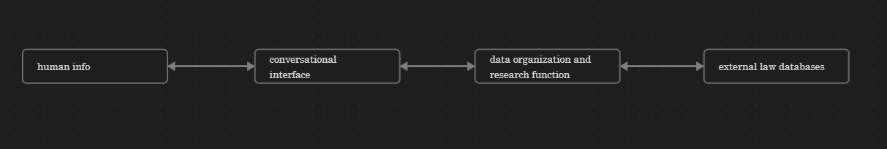

# legal-research
The goal here is to have an automated research function take information about a legal situation as input, ask follow up questions to obtain additional information, identify the applicable laws, identify potential outcomes for the case, and provide potential next steps for the client and/or legal representative.



## Test Case

This describes the data required to test a single legal case for the legal research question of "what laws apply to the facts?".

### Input-Output for research function testing

input:
- case material facts: markdown text string
- source bodies of statutes in the jurisdiction/context: list of (markdown text string, metadata)
- source bodies of case-law in the jurisdiction/context: list of (markdown text string, metadata)
- past private legal case info: list of (markdown text string, metadata)

output:
- actual laws applicable to the case: markdown text string
    - could perhaps be output as: list of (markdown text string, metadata) for each individual applicable law

extension output:
- ambiguities in material facts
- almost applicable laws

### Where the data comes from

case-law document for this particular case:
- case material facts: markdown text string
- actual laws applicable to the case: markdown text string
- actual case-law applicable to the case: markdown text string

jusridiction legal sources:
- source bodies of laws in the jurisdiction/context
- source bodies of case-law in the jurisdiction/context

private legal sources from the law firm (optional):
- past private legal case info

### Challenges with this

how do we obtain the source bodies of laws and case-law?

how do we determine whether a given law or past case applies to the current case?

how do we determine when the story contains ambiguity?

how do we determine when a given law or past case almost apply?

### Possible workflow

need to:
- prioritize (have a prioritized queue of ambiguities/follow-up-questions to ask the client)
- if the client has little detail to add in their story, quickly transition to summary of what's known and where the gaps are
- resolve jurisdictional nuances (international vs. federal vs. state vs. local)
- is it worth it to employ secondary research to determine statute applicability?

Legal Agent Workflow from intake of a client to providing them with next steps.

1. client asks how you can help them:
    - tell them provide me with a legal situation and I'll tell you: which laws apply to your case, the different ways to address your case and their associated potential outcomes, costs, timelines, etc.
    - inform the cilent that the information that they share will stay strictly confidential between the agent and the client. "Your information is secure and confidential as we work through this."
    - confirm that the client understands what is being asked of them
2. specify what the user needs to provide (legal juridiction, material facts/story, legal questions/issues, etc.)
    - "Please provide the key facts of your situation, the state or country where this issue is happening, and any specific legal questions you have."
    - if it they say something ambiguous, flag it in a queue to ask for clarification on that point ("I need clarification on [specific point, e.g., ‘you mentioned a contract but didn’t specify its terms’]. Could you provide more details?", "Could you share more about [specific aspect, e.g., ‘what happened during the incident’] to help me identify the right laws?")
    - if they say something that contradicts what they previously said, present to the client their two contradicting statements and ask them how to resolve this contradiction (e.g. "I noticed two details that seem to conflict. Could you clarify which is correct?" or "I noticed you said [statement A] but also [statement B]. Could you clarify which is correct or provide more context?")
    - otherwise ask them to please tell you more about their story
        - if they have nothing more to say, tell them about the laws that apply to their story
3. find laws that apply to their story
    - statutes first:
        - query list of statutes, for each law, obtain the preconditions for their application, then check and see if each precondition is met by the story. For each precondition of a law, tally whether it is explicitly satisfied, explicitly disatisfied, or if it is ambiguous and more information from the client is needed. For each law, if the law itself is ambiguous in any way, find previous applications of the law to disambiguate the conditions.
        - List laws in increasing order of relevance (e.g. the number of preconditions not explicitly satisfied or some other metric), for each law in this order, for each precondition of each law, we want the client to provide: information to disambiguate uncertain preconditions, supporting evidence to fortify explicity satisfied preconditions, supporting evidence to fortify explicitly disatisfied preconditions. _Not sure which order is best to ask these questions, this would require foresight on what the potential outcomes of the case are_.
    - precedents or case-law first:
        - query cases in the same legal jursidiction that are similar to that of the client story, ensure that the case is still relevant, determine which laws applied in those cases and how the application of the laws in that case disambiguates the applicability and outcome of the law
        - provide this info to the client
    - resolve ambiguities: "To apply this law, I need to know [specific fact]. Can you provide that?" or "This law requires a written contract. Can you confirm if your agreement was written?"
    - If the cilent doesn't have more information to provide to their story, inform them of this in some way (tell client a summary of what has been said so far and what the next steps are, such as "Based on your story, here are the potential laws and gaps we need to address.")
3. Given laws that apply to the situation determine likely client outcomes
    - "A 2023 case in California applied this law to a similar breach, ruling [X]."
    - Use precedents to estimate success rates (e.g., "In 80% of similar cases, plaintiffs won when [condition] was met.")
    - Consider multiple resolution paths: litigation, settlement, mediation, or arbitration.
    - Factor in practical considerations: costs (legal fees, court costs), timelines (e.g., “Litigation may take 6–18 months”), and risks (e.g., “Appeals could extend the timeline”).
    - Include emotional or financial impacts (e.g., “Settling may be faster but could yield a lower payout.”).
    - Ask for their priorities (e.g., “Do you prefer a quick resolution or maximizing compensation?”) to tailor outcome analysis.
4. Tell the client a summary: what they have said so far, what laws you have identified as applicable to their story, what the options are to address their concerns, what ambiguities/contradictions are currently unresolved about their situation or about the state of the law, immediate next steps to be taken at this point by the law firm, and options for the client to make a decision.

## Test Results

### testing `law_applicability.py`
```
(venv) C:\Users\Hendrix\GitHub\legal-research>python test.py
The legal reference provided from the case 1100997 Ontario Ltd. v. North Elgin Centre Inc., 2016 ONCA 848, at para. 19, defines a cause of action as "a factual situation the existence of which entitles one person to obtain from the court a remedy against another person." This definition can be applied in the current case to determine whether the constructive dismissal and wrongful dismissal claims in the Fresh As Amended Statement of Claim are new or if they seek alternative relief based on the same facts.

In this case, the key issue is whether the claims of constructive dismissal and wrongful dismissal in the Fresh As Amended Statement of Claim are new causes of action or if they are based on the same factual situation as previously alleged in the Notice of Action and Statement of Claim. The legal reference helps in analyzing whether the claims are distinct causes of action or if they are seeking remedies based on the same underlying facts.

Based on the case text provided, it appears that the claims of constructive dismissal and wrongful dismissal in the Fresh As Amended Statement of Claim are not new causes of action but rather seek alternative relief based on the same facts previously alleged. The court found that the allegations in the Fresh As Amended Statement of Claim were contained in the Notice of Action and were never abandoned by the plaintiff. Therefore, applying the legal reference, it can be argued that the claims of constructive dismissal and wrongful dismissal are part of the same factual situation entitling the plaintiff to seek remedies against the defendant.

In conclusion, the legal reference helps in determining that the claims of constructive dismissal and wrongful dismissal in the Fresh As Amended Statement of Claim are not new causes of action but rather alternative relief sought based on the same factual situation previously alleged by the plaintiff.

(venv) C:\Users\Hendrix\GitHub\legal-research>pip install -qU "langchain[openai]"

(venv) C:\Users\Hendrix\GitHub\legal-research>python test.py                                                                                                   
Based on the case text provided, it appears that the issue at hand involves whether the constructive dismissal and wrongful dismissal claims in the Fresh as Amended Statement of Claim are considered new claims or if they seek alternative relief based on the same facts as previously alleged. The case text outlines the arguments made by both parties regarding the inclusion of these claims in the original Notice of Action and subsequent Statement of Claim.

In determining whether the Fresh as Amended Statement of Claim seeks alternative relief based on the same facts, the legal reference from 1100997 Ontario Ltd. v. North Elgin Centre Inc., 2016 ONCA 848, at para. 19, defines a cause of action as a factual situation that entitles one person to obtain a remedy against another person.

Applying this legal reference to the case text, it appears that the Fresh as Amended Statement of Claim asserts that the constructive dismissal and wrongful dismissal claims are based on the same factual situation as previously alleged in the Notice of Action and Statement of Claim. The argument is that these claims simply urge a different legal conclusion about the nature of the relationship between Mr. Weekes and Investors Group.

Therefore, the legal reference provided can be used to proceed with this case as it supports the analysis of whether the claims in the Fresh as Amended Statement of Claim are new or seek alternative relief based on the same facts.

Conclusion: Yes

(venv) C:\Users\Hendrix\GitHub\legal-research>python test.py
Based on the case text provided, the legal reference from Timber Estate v. Bank of Nova Scotia can be used to proceed with this case. The case text discusses whether the constructive dismissal and wrongful dismissal claims in the Fresh As Amended Statement of Claim are new or if they seek alternative relief based on the same facts. The legal reference defines a cause of action as a factual situation that entitles one person to obtain a remedy against another. It states that when an amendment relates to material facts not substantially pleaded in the original claim or essential to support the claim being advanced, it raises a new cause of action. In this case, the court analyzed whether the claims in the Fresh As Amended Statement of Claim were new or based on the same facts as previously pleaded. Therefore, the legal reference can be applied to determine if the claims raised in the Fresh As Amended Statement of Claim constitute new causes of action.

Yes

(venv) C:\Users\Hendrix\GitHub\legal-research>python test.py
The legal reference from 71122 Ontario Limited v. Sagaz Industries Canada Inc. discusses the circumstances in which an appellate court may substitute its own findings in the face of an explicit finding of credibility by the trial judge. In the case text provided, the issue at hand is whether the constructive dismissal and wrongful dismissal claims in the Fresh As Amended Statement of Claim seek alternative relief based on the same facts as previously alleged. The judge in the case text considered whether the claims were new or if they simply urged a different legal conclusion based on the same facts. Given that the judge analyzed the specific circumstances of the case and the nature of the claims, it is not directly related to the issue discussed in the legal reference. Therefore, the legal reference cannot be directly applied to the case text provided.

No

(venv) C:\Users\Hendrix\GitHub\legal-research>python test.py
python: can't open file 'C:\\Users\\Hendrix\\GitHub\\legal-research\\test.py': [Errno 2] No such file or directory

(venv) C:\Users\Hendrix\GitHub\legal-research>python law_applicability.py
The legal reference provided in the case of 671122 Ontario Limited v. Sagaz Industries Canada Inc. outlines a test for admission of new evidence on appeal. The test includes factors such as whether the evidence could not have been obtained with reasonable diligence, whether the evidence would have an important influence on the case, and whether the evidence is credible.

In the context of the case text provided, the issue at hand is whether the Fresh As Amended Statement of Claim seeks alternative relief based on the same facts as previously alleged. The test from the legal reference could be relevant in determining whether the new claims in the Fresh As Amended Statement of Claim should be allowed based on the same facts presented earlier.

Considering the facts presented in the case text and the legal reference provided, the test for admission of new evidence on appeal may not directly apply to the specific issue of whether the Fresh As Amended Statement of Claim should be allowed in this case. The legal reference primarily deals with admitting new evidence on appeal, whereas the issue in the case text pertains to the inclusion of new claims in an amended statement of claim.

Therefore, based on the information provided, the legal reference may not be directly applicable to the decision on whether the Fresh As Amended Statement of Claim should be allowed in this case.

No
```

batch_test:
```
The legal reference provided from the case 1100997 Ontario Ltd. v. North Elgin Centre Inc., 2016 ONCA 848, at para. 19, defines a cause of action as "a factual situation the existence of which entitles one person to obtain from the court a remedy against another person." This definition can be applied to determine the outcome of the case in the following way:

In the case text provided, the issue at hand is whether the constructive dismissal and wrongful dismissal claims brought by Mr. Weekes are considered new claims or if they are alternative relief based on the same facts previously alleged. The legal reference helps in understanding that a cause of action is based on a factual situation that entitles a party to seek a remedy from the court.

Applying this definition to the case text, it can be argued that Mr. Weekes' constructive dismissal and wrongful dismissal claims are not new claims but rather alternative legal conclusions based on the same underlying facts that were initially raised in the Notice of Action. Despite the claims not being clearly and precisely particularized in the subsequent Statement of Claim, the legal reference supports the notion that the essence of the claims remains consistent with the original factual situation presented.

Therefore, the legal reference aids in determining that the constructive dismissal and wrongful dismissal claims brought by Mr. Weekes are not new claims but rather alternative relief based on the same facts, and as such, they should not be considered abandoned or statute-barred.
--------------------------------------------------------------------------------
The legal reference from 1100997 Ontario Ltd. v. North Elgin Centre Inc., 2016 ONCA 848, provides a definition of a cause of action as "a factual situation the existence of which entitles one person to obtain from the court a remedy against another person." In the case text provided, Mr. Weekes' Fresh as Amended Statement of Claim seeks alternative relief based on the same facts that were initially included in the Notice of Action. The court also found that the constructive and wrongful dismissal claims were not new, but rather a different legal conclusion drawn from the same facts. Therefore, based on the law information and case text provided, the legal reference can be used to proceed with this case.

Yes
--------------------------------------------------------------------------------
The legal reference from 1100997 Ontario Ltd. v. North Elgin Centre Inc., 2016 ONCA 848, at para. 19, can be applied to determine the outcome of the case by assessing whether the Fresh As Amended Statement of Claim seeks alternative relief based on the same facts previously pleaded.

In this case, the key question is whether the constructive dismissal and wrongful dismissal claims in the Fresh As Amended Statement of Claim are new causes of action or simply different legal conclusions drawn from the same set of facts previously pleaded. The legal reference provided states that a new cause of action is not asserted if the amendment pleads an alternative claim for relief out of the same facts previously pleaded and no new facts are relied upon, or if the amendments simply amount to different legal conclusions drawn from the same set of facts.

Applying this legal principle to the case at hand, it appears that the Fresh As Amended Statement of Claim does not introduce new facts but rather provides additional particulars and a different legal conclusion about Mr. Weekes' relationship with Investors Group based on the same set of facts that were already pleaded in the original Notice of Action and Statement of Claim. Therefore, the legal reference supports the argument that the constructive dismissal and wrongful dismissal claims in the Fresh As Amended Statement of Claim are not new causes of action but rather alternative claims for relief based on the same facts previously pleaded.

In conclusion, based on the legal reference provided, it can be argued that the Fresh As Amended Statement of Claim seeks alternative relief based on the same facts previously pleaded, and therefore, the constructive dismissal and wrongful dismissal claims should not be considered new causes of action.
--------------------------------------------------------------------------------
Based on the case text provided, the legal reference from 1100997 Ontario Ltd. v. North Elgin Centre Inc., 2016 ONCA 848 can be used to proceed with this case. The case text discusses how a new cause of action is not asserted if the amendment pleads an alternative claim for relief out of the same facts previously pleaded and no new facts are relied upon, or if it simply amounts to different legal conclusions drawn from the same set of facts. In this case, Mr. Weekes' Fresh as Amended Statement of Claim seeks alternative relief based on the same facts previously pleaded, indicating that it falls within the principles outlined in the legal reference. Therefore, the legal reference can be applied in this case.

Yes
--------------------------------------------------------------------------------
The legal reference from Timber Estate v. Bank of Nova Scotia, 2011 ONSC 3639, at para. 13, provides guidance on when a proposed amendment raises a new cause of action. It states that when a proposed amendment relates to material facts that were not substantially pleaded in the original claim or are essential to support the claim being advanced, the amendment raises a new cause of action.

In the case text provided, the issue at hand is whether the constructive dismissal and wrongful dismissal claims raised in the Fresh as Amended Statement of Claim are new causes of action or if they are based on the same facts as previously pleaded. The legal reference can be applied to determine if the amendments in the Fresh as Amended Statement of Claim raise new causes of action by assessing whether the material facts supporting these claims were substantially pleaded in the original claim or are essential to the claims being advanced.

Based on the case text, it appears that the Fresh as Amended Statement of Claim seeks alternative relief based on the same facts as previously alleged. The court found that the constructive and wrongful dismissal claims were not new, as they were included in the Notice of Action and were not intentionally abandoned by Mr. Weekes. Therefore, applying the legal reference, it can be determined that the amendments in the Fresh as Amended Statement of Claim do not raise new causes of action, as they are based on the same factual situation and do not introduce substantially new material facts essential to support the claims being advanced.

Therefore, in this case, the legal reference supports the court's decision that the constructive dismissal and wrongful dismissal claims in the Fresh as Amended Statement of Claim are not new causes of action and should not be struck.
--------------------------------------------------------------------------------
Based on the case text provided, the legal reference from Timber Estate v. Bank of Nova Scotia can be used to proceed with this case. The case text discusses whether the constructive dismissal and wrongful dismissal claims in the Fresh As Amended Statement of Claim raise new causes of action or seek alternative relief based on the same facts. The legal reference defines a cause of action as a factual situation that entitles one person to obtain a remedy against another person. It states that when an amendment relates to material facts not substantially pleaded in the original claim or essential to support the claim being advanced, it raises a new cause of action. In this case, the court analyzed whether the claims in the Fresh As Amended Statement of Claim were new or based on the same facts as previously pleaded. The legal reference provides guidance on determining when an amendment raises a new cause of action. Therefore, the legal reference can be used to proceed with this case.

Yes
--------------------------------------------------------------------------------
The legal reference provided in the case of 671122 Ontario Limited v. Sagaz Industries Canada Inc. discusses the circumstances in which an appellate court may substitute its own findings in the face of an explicit finding of credibility by the trial judge. It emphasizes that such a substitution is exceptional, and the best outcome in such cases would typically be a new trial.

In the current case text regarding Ralph Weekes and Investors Group Financial Services Inc., the issue at hand is whether the constructive dismissal and wrongful dismissal claims brought by Mr. Weekes are considered new claims or if they were abandoned. The legal reference provided does not directly apply to the specific issue in this case, as it pertains to credibility findings by a trial judge rather than the determination of whether certain claims are new or abandoned in a legal proceeding.

Therefore, in this case, the legal reference is not directly applicable to determine the outcome of whether the constructive dismissal and wrongful dismissal claims are new or abandoned. The decision in this matter would need to be based on the specific facts and legal arguments presented in the case text and relevant legal principles related to the abandonment of claims in civil proceedings.
--------------------------------------------------------------------------------
The legal reference provided, 671122 Ontario Limited v. Sagaz Industries Canada Inc., 2000 CanLII 5624 (ON CA), at para. 25, discusses the circumstances in which an appellate court may substitute its own findings in the face of an explicit finding of credibility by the trial judge. In the case text provided, the issue at hand is whether the constructive dismissal and wrongful dismissal claims in the Fresh As Amended Statement of Claim seek alternative relief based on the same facts as previously alleged. The court is considering whether Mr. Weekes abandoned these claims or if they were included in the original Notice of Action. 

Based on the case text and the legal reference provided, the legal reference does not directly apply to the specific issue at hand in this case. The case text focuses on whether the claims were abandoned or not, rather than on the credibility of a witness or the findings of a trial judge. Therefore, the legal reference cannot be directly used to proceed with this case.

No
--------------------------------------------------------------------------------
The legal reference provided, which is an excerpt from the case 671122 Ontario Limited v. Sagaz Industries Canada Inc., 2000 CanLII 5624 (ON CA), outlines a test for admission of new evidence on appeal. The test includes three factors: (1) the evidence could not have been obtained with reasonable diligence for use at the trial, (2) the evidence would probably have an important influence on the result of the case, and (3) the evidence must be credible.

In the context of the case text provided, this legal reference may not be directly applicable to determine the outcome of the case. The case text primarily deals with whether the constructive dismissal and wrongful dismissal claims raised by Mr. Weekes are considered new claims or if they were included in his original Notice of Action. The legal reference regarding admission of new evidence on appeal is more focused on introducing new evidence after judgment has been handed down.

Therefore, in this case, the legal reference may not directly apply to determining whether the constructive dismissal and wrongful dismissal claims are new or not. The outcome of the case will likely be based on the interpretation of the facts and legal arguments presented in the case text, rather than the specific test outlined in the legal reference.
--------------------------------------------------------------------------------
Based on the case text provided, the legal reference from 671122 Ontario Limited v. Sagaz Industries Canada Inc. may not be directly applicable to the issues raised in this case. The case text primarily deals with the determination of whether the constructive dismissal and wrongful dismissal claims are new, and whether they were abandoned by the plaintiff. The legal reference, on the other hand, discusses the criteria for admitting new evidence on appeal, which is not directly related to the issues at hand in this case.

Therefore, the legal reference may not be directly relevant or applicable to the specific issues raised in this case regarding the constructive dismissal and wrongful dismissal claims.

No
--------------------------------------------------------------------------------
```